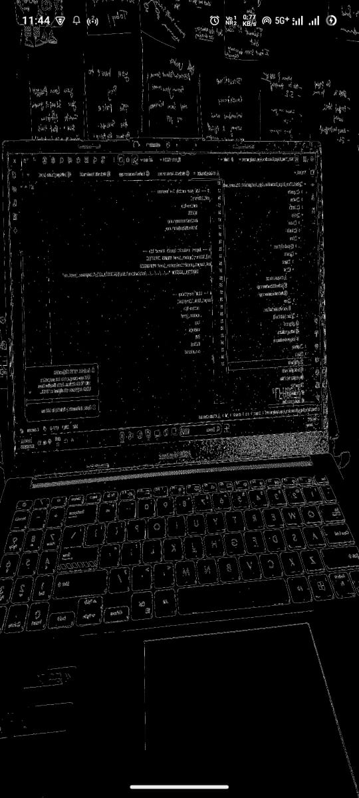
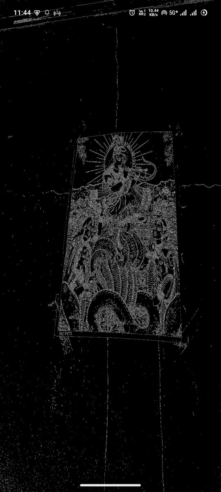
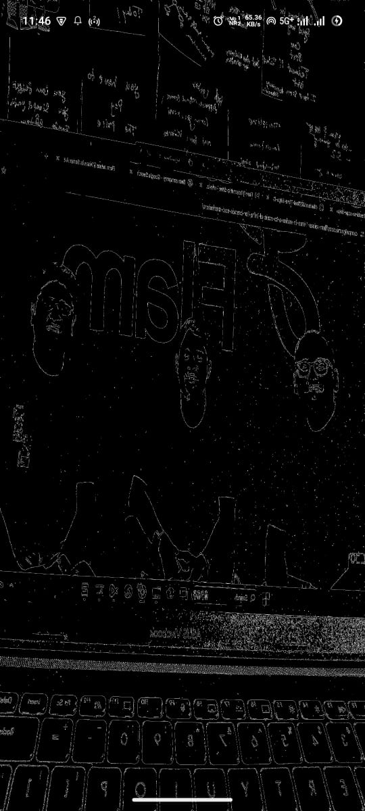
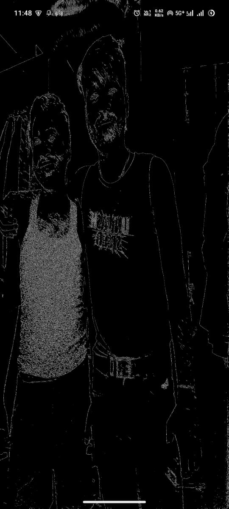
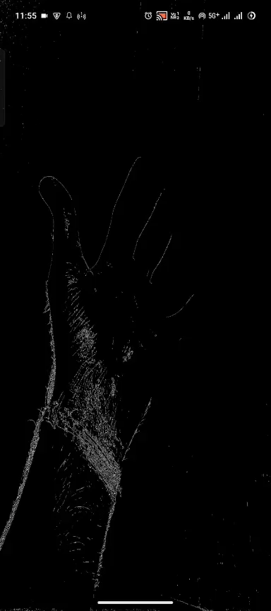

# Real-Time Edge Detection Viewer

##  Features implemented (Android + Web)
- **Android:**
  - Camera feed integration using TextureView 
  - Frame processing via OpenCV (C++) using JNI
    - Grayscale filter
    - Canny edge detection
  - Render processed frames using OpenGL ES 2.0
  - Real-time performance (≥10–15 FPS)
- **Web:**
  - Minimal TypeScript + HTML page
  - Displays a static processed frame (captured from Android app)
  - Basic overlay for frame stats (FPS, resolution)

---

##  Screenshots or GIF of the working app

---

##  Setup instructions (NDK, OpenCV dependencies)

### Android
1. Clone the repository:
   
   git clone <repo_url>
Install Android Studio (latest version recommended)

Install NDK and CMake from SDK Manager

Place OpenCV SDK in the Project folder

Configure CMakeLists.txt to include OpenCV headers and link libraries

Connect an Android device (minSdk 24) and run the app

Web
// working

 Quick explanation of architecture (JNI, frame flow, TypeScript part)
Frame Flow:

Camera (Android) → JNI → OpenCV C++ Processing → OpenGL ES Renderer → Display → Web Viewer
Android (Java/Kotlin): Captures camera frames and sets up UI/OpenGL surface

JNI: Passes frames between Android and C++ native code

C++ (OpenCV): Processes frames with Grayscale / Canny Edge Detection

OpenGL ES: Renders processed frames in real-time

Web Viewer (TypeScript + HTML): Displays static processed frame and basic frame stats
